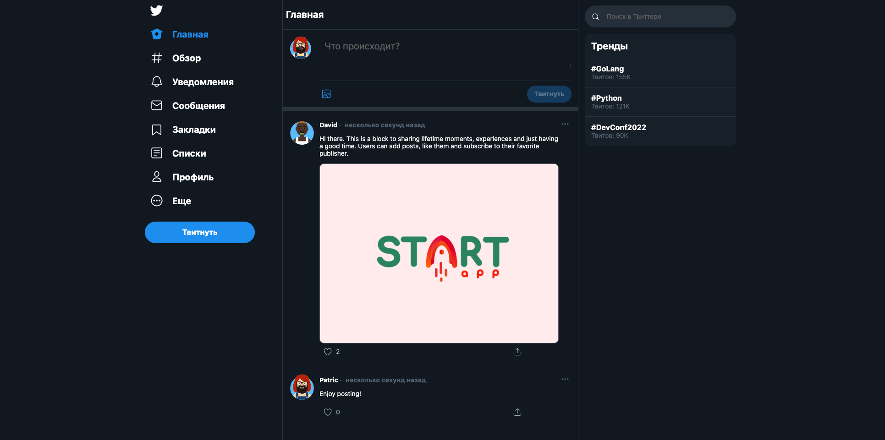

# Getting started
The application is written in [Python v3.10.](https://docs.python.org/3.10/) using database [PostgreSQL](https://www.postgresql.org/docs/) with [asncpg](https://magicstack.github.io/asyncpg/current/). In order to working with database [SQLAlchemy](https://docs.sqlalchemy.org/en/20/) is used.

## Navigation

  * [What can the application do](#what-can-the-application-do)
  * [Installation](#installation)
  * [Settings](#settings)
  * [Testing](#testing)
  * [Application structure](#application-structure)

## What can the application do?
The application is used as mini-block platform sharing lifetime moments, experiences and just having a good time.
Users can add posts, like them and subscribe to their favorite publisher.



## Installation
1. Install [Python v3.10.](https://docs.python.org/3.10/)
2. Install [Docker](https://docs.docker.com/engine/install/)
3. Install [poetry](https://python-poetry.org/) for packaging and dependency management.
4. Clone this repo and `cd` into it;
5. Activate virtual environment
   ```shell
   poetry config virtualenvs.in-project true &&
   poetry install
   ```
6. Copy `env.dist` to `.env` (with dot);
7. Run the app into Docker container:
    ```shell
    docker compose up --build
    ```
8. Go to PostgreSQL interactive terminal and check if database exists:
   ```shell
    docker exec -it db psql -U $POSTGRES_USER -d $POSTGRES_DB
    ```
    [PSQL command list](https://www.postgresql.org/docs/10/app-psql.html):
    ```shell
    \l                                 # db list
    \c                                 # current connection
    \c $POSTGRES_DB                    # switch to $POSTGRES_DB
    ```

7. Enjoy using the app

## Settings:
```
POSTGRES_USER=example_user
POSTGRES_PASSWORD=example_password
POSTGRES_DB=example_db
MEDIA_DIR=example_media_dir
TEST_DB=example_test_db
```
## Testing
To fulfill application testing run following command:

```shell
docker compose up -d db &&
docker compose build server &&
docker compose run --rm server pytest tests/ -v
```

After test completion use the following command to stop containers:
```shell
docker compose stop
```


## Application structure
```zhs
app/
├── .venv/
│   └── ... # Other files
├── db/
│   └── ... # Database files
├── client/
│   ├── __init__.py
│   ├── static/
│   │   ├── css/
│   │   ├── js/
│   │   ├── media/
│   │   ├── index.html
│   │   ├── favicon.ico
│   │   └── ... # Database files
│   ├── Dockerfile
│   └── nginx.conf
├── server/
│   ├── __init__.py
│   ├── migrations/
│   │   ├── versions/
│   │   ├── env.py
│   │   ├── __init__.py
│   │   └── # Other files
│   ├── alembic.ini
│   ├── .coveragerc
│   ├── main.py
│   ├── models.py
│   ├── logger_config.py
│   ├── services/
│   │   ├── __init__
│   │   ├── base.py
│   │   ├── service.py
│   │   └── utils.py
│   ├── database.py
│   ├── schemas.py
│   ├── tests/
│   │   ├── __init__
│   │   ├── test_mytest.py
│   │   ├── conftest.py
│   │   └── pytest.ini
│   ├── Dockerfile
│   ├── entrypoint.sh
│   └── ... # Other server configurations
├── logs/
│   ├── db/
│   └── twitter_application/
├── scripts/
│   └── custom-init.sh
├── poetry.lock
├── .config.toml
├── .flake8
├── .gitignore
├── .gitlab-ci.yaml
├── .pre-commit-config.yaml
├── .gitlab-ci.yaml
├── pyproject.toml
├── docker-compose.yml
├── fabfile.py
└── READMY.md
```
